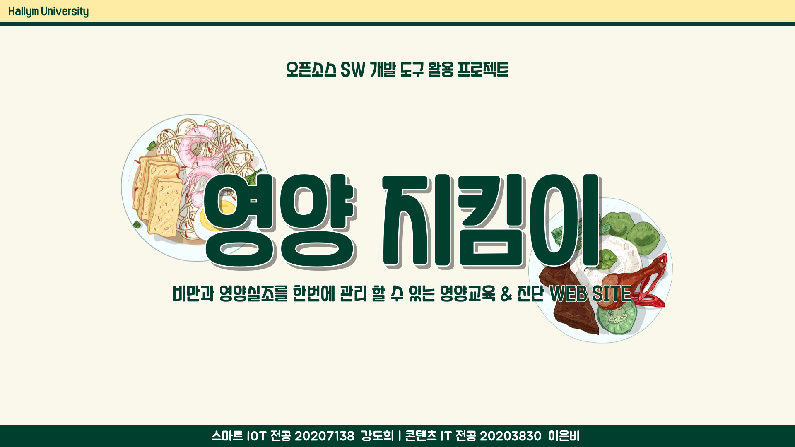
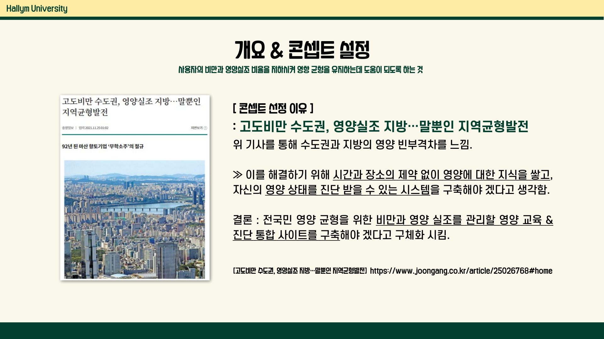
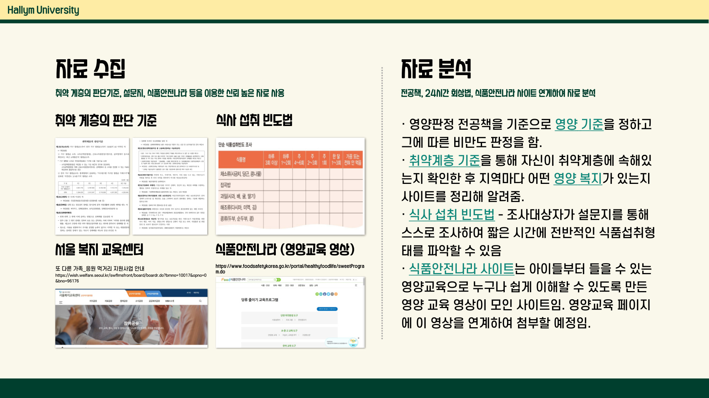
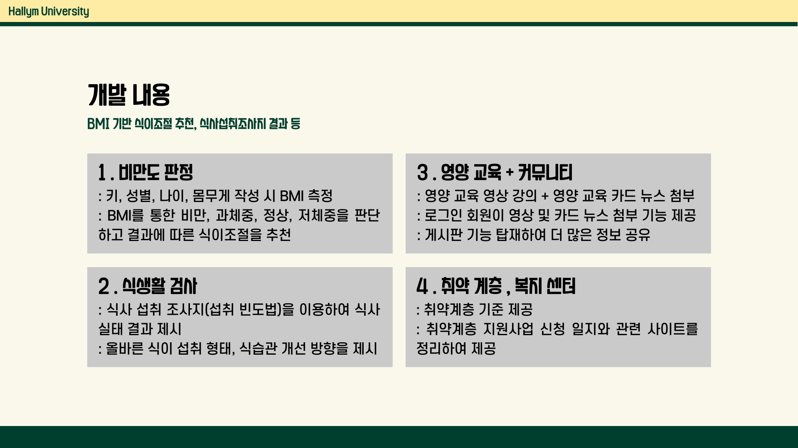

# Nutrition Education Diagnosis Website

Nutrition Education Diagnosis Website, Hallym Univ, Development of Design & Front-End (Nov. 2022 ~ Dec. 2022)  

- 사이트 이름 :   
- 콘셉트 : 비만과 영양실조를 한 번에 관리할 수 있는 영양 교육 & 진단 시스템  
- [선정 이유] 
: [고도비만 수도권, 영양실조 지방... 말뿐인 지역균형발전](https://www.joongang.co.kr/article/25026768#home) 기사를 통해 수도권과 지방의 영양 빈부격차를 느낌. 
이를 해결하기 위해 시간과 장소의 제약 없이 영양에 대한 지식을 쌓고, 자신의 영양 상태를 진단 받을 수 있는 시스템을 구축해야 겠다고 생각함. 결론적으로, 전국민 영양 균형을 위한 비만과 영양 실조를 관리할 영양 교육 & 진단 통합 사이트를 구축해야 겠다고 구체화 시킴. 

[자세한 사이트 개발 내용]
- [🎥 시연 동영상](https://www.youtube.com/watch?v=wbbpgStU9_g) & [📑 발표 자료](https://www.miricanvas.com/v/11ltj6s)

